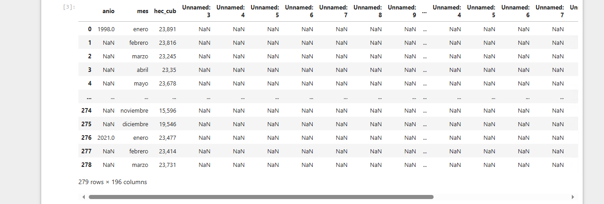
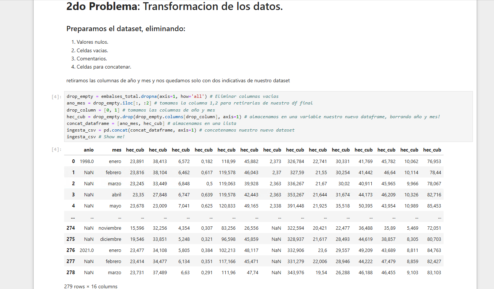
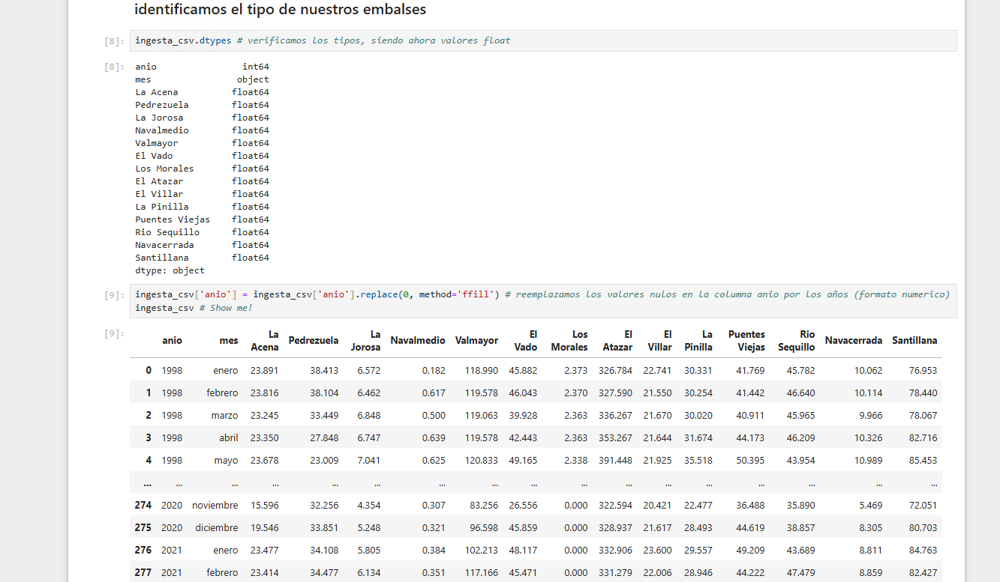
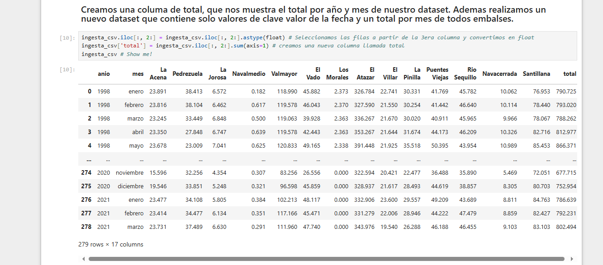
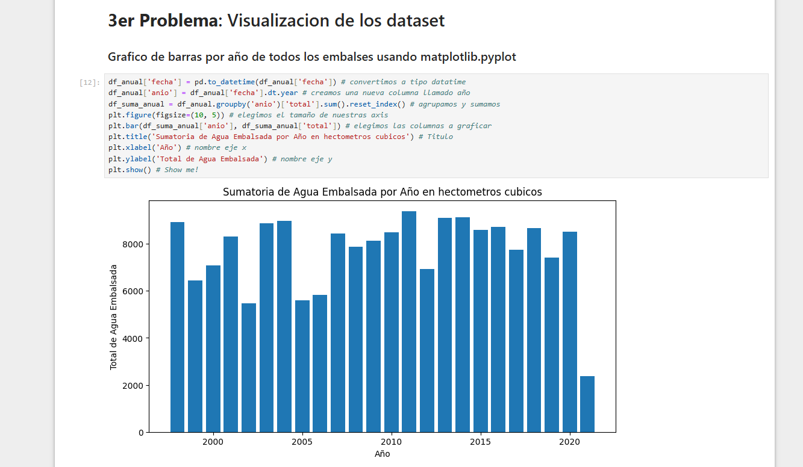
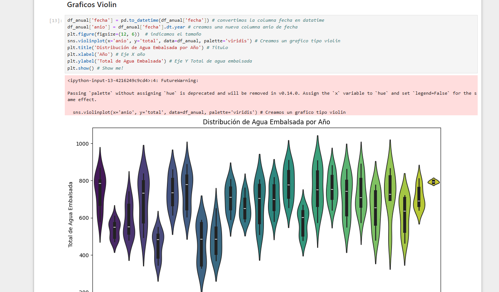
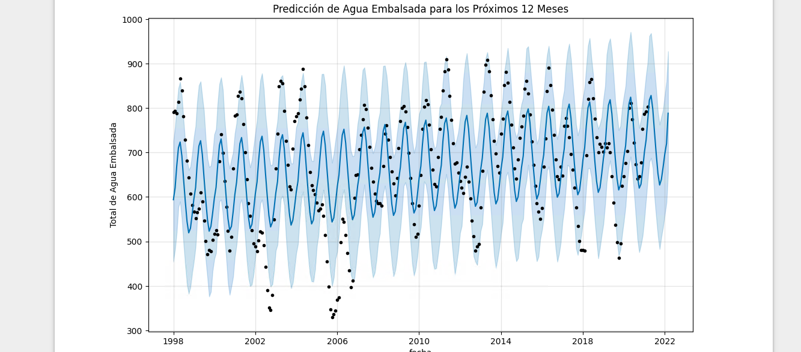
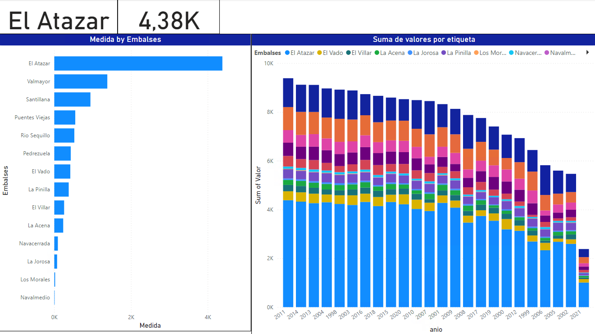

# Real Case Big Data Project
> Enfocamos este proyecto en utilizar herramientas de machine learning, para predecir una futura sequia, esto con ayuda de datos obtenido a traves de fuentes abiertas, realizando ETL, Gobierno del Dato, Visualizacion y Prediccion.
## Codigo, Etl, Prediccion
> Importamos librerias y realizamos una concatenacion de nuestro datasets, con la finalidad de obtener valores absolutos y trabajar todo esto como un conjunto de datos en python.

## Realizamos una "limpieza de los datos"
> Eliminamos valores Nulos, celdas vacias, comentarios. Aprovechamos tambien para darle una descripcion a nuestros datos, como los datasets fueron realizados con los nombres de embalses de rios, colocamos los siguientes en el codigo.

## Integers, floats, types.
> A traves de la limpieza, podemos observar el comportamiento del los tipos de datos que encuentra python en la conversion, con la finalidad de trabajar mejor (en pro de una posible suma) trabajaremos con "integers" e intentaremos eliminar ",". Esto nos ayudara en un futuro a realizar la suma de nuestros datasets.

## Clave - Valor.
> Damos un nuevo orden a nuestro dataset, comenzando por los años y meses en los que acumulaba agua. Tambien utilizamos un diccionario clave-valor para emparejar meses y añosalmacenados.

# Graficos
## Graficos tipo barra
> conseguimos visualizar la cantidad de agua almacenada de todos los embalses por año.

> Grafico tipo violin

## Final ETL y Prediccion

# Power Bi Graphics

