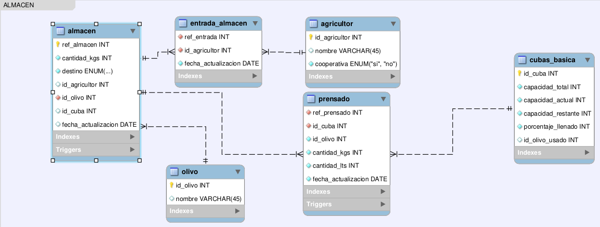
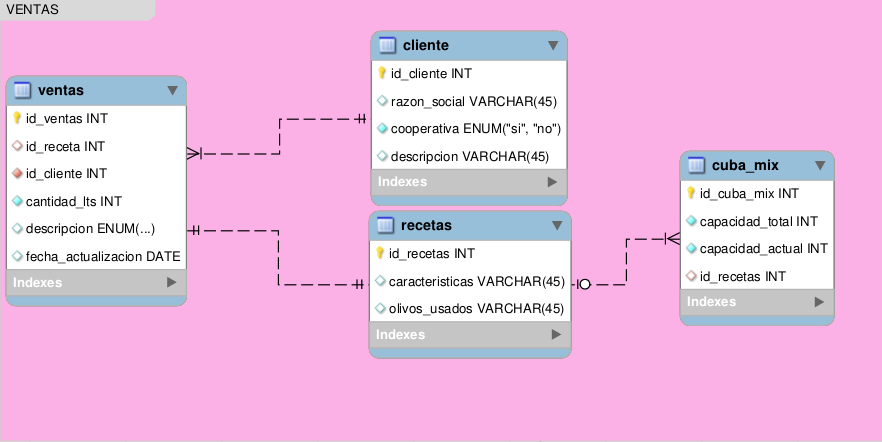

<h1 align="center">MODELO DE NEGOCIO DE UNA EMPRESA DE ACEITE DE OLIVA</h1>

> `Explicaremos los detalles de nuestro codigo y como podemos adaptarlo a un modelo de negocios.`

<h1 align="center">INSTALACION</h1>
Dependera mucho de los sistemas operativos que utilices, sin embargo te dejo una pequeña guia en los que fue testeado este sistema

<h2>Linux</h2>


<h2>Windows</h2>


<h1 align="center">DISEÑO DE ALMACEN</h1>



<h1 align="center">DISEÑO DE VENTAS</h1>



<h1 align="center">PRUEBAS</h1>

Podemos dividir las pruebas en las siguientes:

- Tabla Agricultor
```sql
# Ejemplo
select * from agricultor; 
insert into agricultor(nombre,cooperativa) values ("fernando", "si");
```
- Tabla Olivo
```sql
# Ejemplo
select * from olivo;
insert into olivo(nombre) values ("olivo_super");
```
- Tabla Cliente
```sql
# Ejemplo
select * from cliente;
insert into cliente(razon_social, cooperativa) values ("mallorca","si");
```
- Tabla Almacen
```sql
# Ejemplo
select * from almacen;
insert into almacen(cantidad_kgs,destino,id_agricultor,id_olivo) values (3000,"almacen",1,2);
```
- Tabla Ventas
```sql
# Ejemplo
SELECT * FROM VENTAS;
select * from recetas;
select * from cliente;
insert into ventas(id_receta, id_cliente, cantidad_lts) values (1,1,1000);
```
- Tabla Recetas
```sql
# Ejemplo
select * from recetas ;
insert into recetas(caracteristicas,olivos_usados) values ("10% / 90%", "picual,cornibranca");
```
- Tabla Cuba basica
```sql
# Ejemplo
select * from cubas_basica; 
insert into cubas_basica(id_cuba,capacidad_total,capacidad_actual) value (5,3000,1000);
```
- Tabla Cuba mix
```sql
# Ejemplo
select * from cuba_mix;
select * from recetas;
insert into cuba_mix(capacidad_total,capacidad_actual,id_recetas) values (3000,0,2);
```
- Tabla Entrada a almacen
```sql
# Ejemplo
select * from entrada_almacen ;
```
- Tabla Prensado
```sql
# Ejemplo
select * from prensado;
```

Encontraremos un documento detallado con todos los testeos en: 

- [Testeo](https://github.com/ricardomzacarias/u_projects/tree/main/database_design_development/QUERY_TESTEO_COMPLETO.sql)

