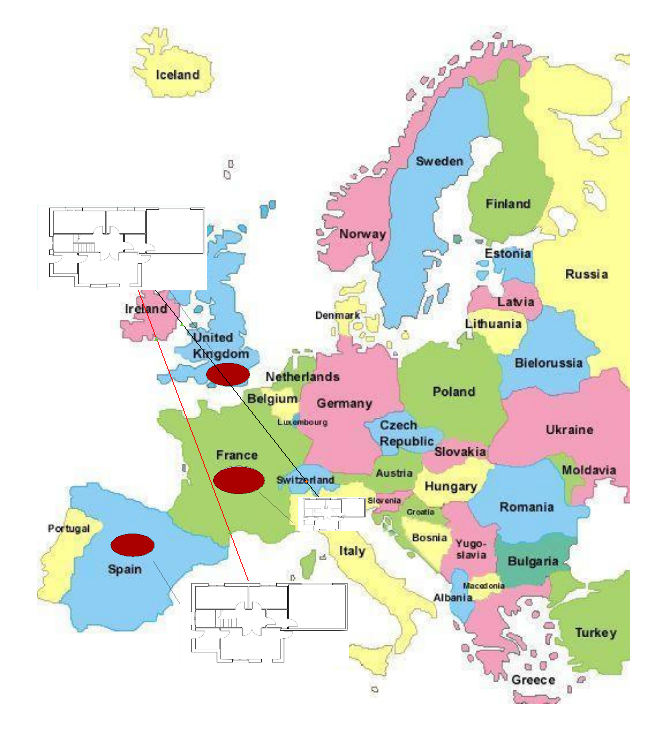
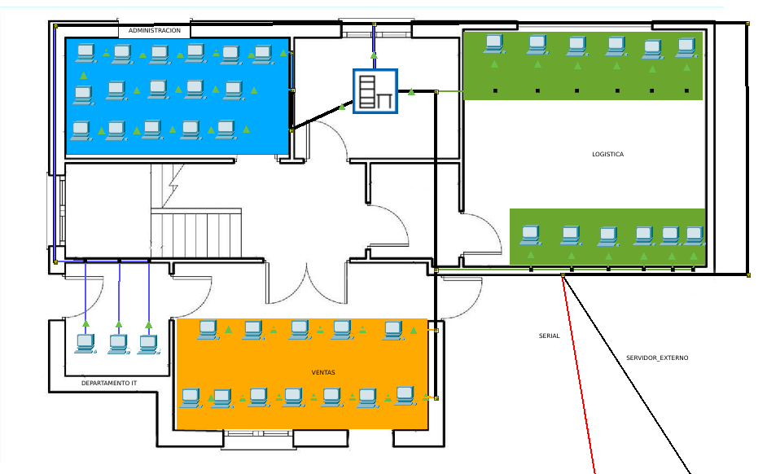
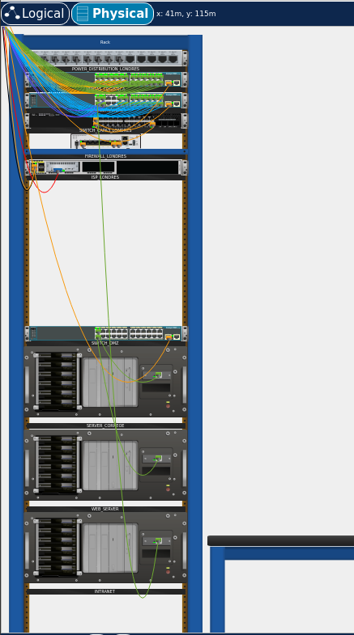
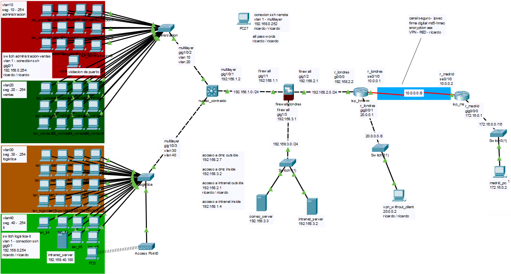

# NETWORK SECURITY
Desarrollamos un proyecto que tiene como finalidad demostrar la importancia de la seguridad en redes (seguridad de la informacion) para una importante empresa en el sector "retail".

El proyecto debe cumplir los siguientes requisitos:

- Debe Contar con dos servidores fisicos, enmascarando su direccion real.
- Debe estar dividida en departamentos.
- Es necesario la implementacion de un servidor con recursos compartidos (intranet) entre los departamentos.
- Acceso inalambrico interno.
- Conexion segura entre departamentos de diferentes paises.
- El hardware debe estar protegido, demostrando las diferentes capaz de seguridad que protegeran el entorno.

Ademas debemos preservar la **Confidencialidad, Integridad y Disponibilidad** de la informacion en todo momento.
## protocolos usados
- HTTPS
- DTLS
- SSH
- WPA3
- DHCP
- TCP/IP
- IPSEC
- SSL/TLS
## Hardware utilizado en este proyecto
- Switch 2960-24TT
- Switch Multilayer 3650-24PS
- Firewall ASA 5506-X
- Router ISR 4331
## Plano fisico y logico
- Representacion grafica de ubicacion de las oficinas a nivel mundial.

- Plano fisico de departamentos.

- Plano de seguridad fisica de servidores.

- Distribucion Logica del proyecto (terminado)

## Medidas de seguridad a implementar:
### hardening básico para los dispositivos
### vlan’s para los switches inside.
### parámetros dhcp en el núcleo contraído.
### seguridad en capa de acceso, en los switch, colocando seguridad de puerto.
### conexión ssh para acceso remoto seguro al núcleo contraído
